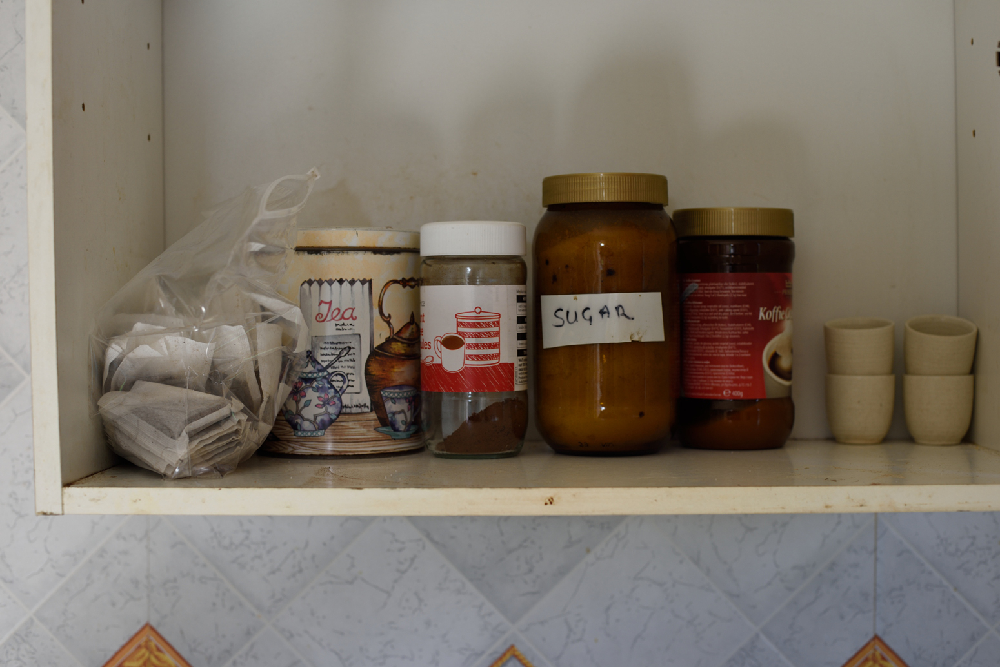

# Introduction {#intro}

> [There is a] remarkable robustness of inequalities in mortality across time and space [@mackenbach2015a, p. 60].

Health inequalities persist despite decades of effort to reduce them.
Faced with a reduction in public spending, contraction of the welfare state, and rising inequality it is likely that health inequalties will increase for years to come and the problems associated with these will be exacerbated.

Individuals, communities, and local public agencies are increasingly looking for ways to mitigate the worst effects of widening health inequalities in the absence of policy to reduce them.
Health resilience is one such solution thought to mitigate the effects of health inequalities.

Resilience has a history spanning several decades, emerging in psychological literature in the 1970s.
In this and later literature resilience is thought of as the "...factors and processes that promote escape from disadvantage" [@schoon2006a, p. 1].
In the case of health resilience, health inequalities confer real disadvantage in terms of morbidity and mortality for individuals across the social gradient in health.

If health inequalities are the disadvantage, what is the 'escape'?
In the health domain reduced morbidity and premature mortality are the 'goal' of resilience, and a number of measures of morbidity are used.
Resilience, then, is having better--than--expected health outcomes given the exposure to disadvantage.
For this reason many authors describe the act of overcoming adversity as 'beating' [@bartley2006b], 'defying' [@cairns2013a], or 'overcoming' [@werner1992a] the odds.

A better understanding of health resilience, which areas and individuals are resilient, and what factors might 'protect' their health outcomes might help develop policies to break down the link between disadvantage and health.
I offer evidence to understand health resilience in the case study area of Doncaster, a large town in the Yorkshire and The Humber region in the north of England.
Doncaster, as a former mining area, is an ideal site for case study because it is exposed to significant disadvantage associated with areas of former heavy industry, mining, and manufacturing [@doran2006a, p. 686].
Section \@ref(doncaster-profile) provides context of the Doncaster area and its socio--economic and demographic characteristics.

I achieve this with a systematic scoping literature review and spatial microsimulation of resilient characteristics at the small--area level to answer the research questions below.
There are numerous ways 'resilience' is operationalised and equally numerous factors thought to contribute to resilience in the literature.
The scoping review allowed me to systematically capture the breadth of measures and factors related to resilience.

Similarly there are numerous data sets that are available to social science researchers in the UK for the study of many aspects of social life, including health inequalities, but there is still a lack of readily--available data at a small--area level [@ballas2005b, p. 19].
Spatial microsimulation produces *simulated* spatial micro--data, addressing this shortcoming to a large extent.
With increasing computational power readily available it is becoming more straightforward to use simulation techniques to fill this void.
This thesis contributes to the health resilience literature by using spatial microsimulation to estimate individual--level data at the small--area level, which has previously not been applied in this domain.


## Research questions

With this research I aim to explore health resilience and the factors that influence it in more detail than previous literature has achieved.
In particular, the research questions I answer are:

1. How are 'disadvantage', 'good health outcomes', and therefore resilience, operationalised in existing literature?
1. What characteristics are thought to affect resilience in this literature?
1. How does the local area affect health resilience and contribute to positive health outcomes?
1. Where and how will resilience be affected by local and national policy intitiatives over the next four years?

I identify how disadvantage, good health outcomes, and resilience are operationalised in the existing literature, and which characteristics are thought to affect resilience, using a systematic scoping review, described in Chapter \@ref(sysrev) (items 1 and 2).
I simulate a comprehensive range of these characteristics and discuss their geographical distribution in Doncaster in Chapter \@ref(ressim) (item 2).
I also simulate clinical depression and indicators of poverty to examine health resilience in Doncaster which I outline in Chapters \@ref(ressim) and \@ref(policy) (item 3).
I review how resilience could be affected by local and national policy in Section \@ref(policy-effects) of Chapter \@ref(policy) (item 4).
I therefore simulate three sets of information: clinical depression and deprivation (health resilience); resilient characteristics; and a range of indicators of poverty, such as benefit recipients.


## Originality and contribution to knowledge

In many countries, including the UK, few data sets are available with small--area geographies [@birkin1988a].
The spatial microsimulation technique I use in this research permits the use of health measures that have not previously been possible to explore at the small--area level, and this is a key strength of this study.
It allows the construction "a much richer dataset that would allow us to investigate an individual's health at a very fine level of spatial resolution..." [@morrissey2013a, p. 221].
Existing literature has used health outcomes available in the census---which are limited to self--reported general health and limiting long--term illness or disability---to examine resilience geographically.
@tunstall2007a and @cairns2012a, for example, are limited to English parliamentary constituencies.
This research is able to address many of the explicit limitations of @cairns2012a and similar studies by examining health resilience at a much smaller geographical level than has previously been possible [-@cairns2012a, p. 932].

A significant benefit of an individual--level simulation at a small--area level is the ability to begin to explore area--level effects of health resilience while taking into account individual characteristics.
Without individual--level small--area data it is difficult to separate area--level and individual--level effects on health because individuals with similar characteristics tend to cluster together.
For example, most data available at the small--area level is aggregated, such as the census.
Because of this it is not possible to determine if differences in health outcomes between areas are because of differences in the area, or differences in the individuals who live in that area.
The spatial microsimulation technique can take account of the individual level when exploring differences in health outcomes between areas.

This study is the first to use data from *Understanding Society* to explore health resilience.
By using spatial microsimulation I add a geographical dimension to this---largely---aspatial data.
*Understanding Society* is a rich data source with comprehensive socio--demographic and health variables available.
Previous studies have attempted to articulate concepts thought important to resilience, but have been limited by the quantitative measures available.
With *Understanding Society* I am able to offer a more comprehensive analysis of resilient characteristics.
*Understanding Society* has a large sample of respondents making it a robust choice to reflect the diversity of an area.


## Thesis structure

This thesis is structured as follows.
This chapter concludes with a profile of Doncaster to provide descriptive context about the area and its residents.

Chapter \@ref(reslit) summarises the historical and contemporary resilience literature.
This provides the theoretical basis of the analysis and informs the operationalisation of resilience that I use throughout.
This chapter identifies a lack of consensus in resilience and resilient characteristics, which I address in Chapter \@ref(sysrev), which is a systematic scoping literature review of health resilience measures adopted in contemporary literature.
I include a comprehensive range of resilient characteristics and measures in my analyses which are informed by the results of this chapter.

Chapter \@ref(smslit) outlines the spatial microsimulation technique.
I summarise the history of spatial microsimulation in the social sciences, demonstrating its rich precedent as a robust method.
I describe a number of spatial microsimulation studies in the health domain both domestically and internationally, illustrating the technique's utility in examining health outcomes.
There are a number of different ways to create a spatially microsimulated data set, so I also summarise these here and state how I will produce my own model and my reasons for these methodological choices.

In Chapter \@ref(methods) I begin the spatial microsimulation process.
I identify suitable constraints, which can be thought of as analogous to independent variables in regression, and prepare these from census data, matching them with data available in the *Understanding Society* survey.
I test these constraints using logistic regression techniques, and create a 'pilot' simulation.

Chapter \@ref(ressim) is the simulation of resilience itself.
I expand on the methods in Chapter \@ref(methods) to include additional constraints to improve the model fit.
I simulate health outcomes, socio--economic risk, and resilience characteristics identified in Chapter \@ref(sysrev).

My analysis of this data is presented in Chapter \@ref(policy).
With individual--level data at the small--area I am able to explore how the proximity of amenities is associated with resilience.
Using the simulated data I describe a rich picture of the charactistics of residents living in four resilient case study areas, and explore narratively the characteristics that might make them resilient compared to their socio--economic peers.
I finish this chapter with an analysis of local and national policy and their effects on health outcomes and resilience at the small--area level.

A number of supplementary materials supported the preparation of this thesis, and these can be downloaded in their entirety from `https://github.com/philmikejones/hrsim/archive/master.zip`.
I sometimes refer to some of these files in footnotes, and in these cases the path I specify to the file is found in this zip file.


## Doncaster profile {#doncaster-profile}

Doncaster is a unitary authority in the historical county of South Yorkshire, in the Yorkshire and The Humber region of England.
Figure \@ref(fig:don-yh-gb) shows the location of Doncaster local authority (dark grey) within Great Britain with the historical county of South Yorkshire and the Yorkshire and The Humber region shown for context.
Figure \@ref(fig:don-sy-yh-map) is a close--up of the Yorkshire and The Humber region, showing Doncaster within the historic county of South Yorkshire and the Yorkshire and The Humber region itself.

```{r don-yh-gb, cache=TRUE, fig.width=7, fig.height=7, fig.cap="Doncaster local authority shown within the Yorkshire and The Humber region and Great Britain"}
tm_shape(gb_outline) +
  tm_borders() +
tm_shape(yh_region) +
  tm_borders() +
tm_shape(sy_county) +
  tm_borders() +
tm_shape(don_outline) +
  tm_fill(col = "darkgrey") +
tm_scale_bar() +
tm_layout(frame = FALSE)
```

```{r don-sy-yh-map, cache=TRUE, fig.width=7, fig.height=7, fig.cap="Doncaster local authority shown within the historic county of South Yorkshire and the Yorkshire and The Humber region"}
tm_shape(yh_region) +
  tm_borders() +
tm_shape(sy_county) +
  tm_borders() +
tm_shape(don_outline) +
  tm_fill(col = "darkgrey") +
tm_scale_bar() +
tm_layout(frame = FALSE)
```

### Population

The population of Doncaster was $`r format(lads@data$pop_1000[lads@data$name == "Doncaster"] * 1000, big.mark = ",", trim = TRUE)`$ on census day 2011 [@nomis2013a; @census].
The majority of the population lives within the urban area of Doncaster town itself, which includes the suburbs of Balby, Bessacarr, Armthrope, and Bentley.
Neighbouring towns of Mexborough, Conisborough, and Thorne also have significant populations.
Much of the rest of the borough is made up of less populated rural areas.
Figure \@ref(fig:don-pop) shows the major population centres of Doncaster.

```{r don-pop, cache=TRUE, fig.width=7, fig.height=7, fig.cap="Doncaster population aged 16 and over"}
tm_shape(don_comm) +
  tm_polygons(col = "pop_16_plus", title = "Population aged 16 and over") +
tm_shape(don_comm[don_comm@data$pop_16_plus > 5000, ]) +
  tm_text(text = "comm_name", size = "pop_16_plus", legend.size.show = FALSE) +
  tm_layout(frame = FALSE)
```

The areas within Doncaster depicted in Figure \@ref(fig:don-pop) are 'community areas'.
These were designed by Doncaster Metropolitan Borough Council to represent a relatively homogoneous area or neighbourhood, and are constructed from statistical output areas.
This makes it relatively easy to perform analyses at community level area by obtaining data at output area level and combining to form community areas.
Figure \@ref(fig:comm-oac) shows Doncaster community area boundaries with constituent 2011 output area classifications [@ons2015c].
Most community areas are constructed from similar output areas suggesting they are relatively homogoneous units.

```{r comm-oac, cache=TRUE, fig.width=7, fig.height=7, fig.cap="Doncaster output area classifications (supergroups) overlaid with community area boundaries"}
tm_shape(don_oa) +
  tm_polygons(col = "spg_name", alpha = 0.6,
              title = "OAC Supergroup") +
tm_shape(don_comm) +
  tm_borders(col = "black") +
tm_layout(frame = FALSE)
```

Figure \@ref(fig:pop-cartogram) is a population cartogram of Doncaster.
It shows the same population information as Figure \@ref(fig:don-pop), but is reprojected based on the size of the population in each area [@gastner2004a].
Areas with larger populations are depicted as larger, and conversely areas that have a smaller population are depicted as smaller.
Cartograms generally are useful for depicting a topic of interest---in this case population---on a geographical area which can be resized to reflect the human interest rather than the area of the land [@barford2006a; @ballas2011a].

```{r pop-cartogram, out.width="100%", fig.cap="Doncaster population aged 16 cartogram"}
knitr::include_graphics("figures/cache/don_pop_cart.pdf")
```

### Deprivation

Doncaster is one of the most deprived local authority districts in England overall, based on the English indices of multiple deprivation (IMD) 2015 [@comlocgov2015a].
The IMD is a composite measure considering income, employment, education, health, crime, access to housing and services, and living environment.
The index combines these individual deprivation domains to produce one overall measure [@comlocgov2015b, p. 12].
Figure \@ref(fig:imd-rank) shows the IMD rank for each local authority in England.
Lower ranked areas are more deprived; Doncaster is therefore one of the 50 most deprived local authorities in England.

```{r imd-rank, cache=TRUE, fig.width=7, fig.height=7, fig.cap="IMD 2015 average rank (lower rank is more deprived)"}
tm_shape(lads) +
  tm_polygons(col = "imd_rank", palette = "-YlOrBr",
              title = "IMD 2015 rank", showNA = FALSE) +
  tm_layout(frame = FALSE)
```

Breaking down the overall index, Doncaster is within the 50 most deprived local authorities for the income, employment, education, health, and crime domains.
Doncaster is less deprived in the living environment domain and one of the least deprived areas in the country based on access to housing and services [@comlocgov2015a].

Doncaster overall is clearly relatively deprived for multiple domains, but there is significant variation within Doncaster [@comlocgov2015a].
Many of the urban areas in and immediately around Doncaster town centre, Mexborough, Connisborough, and Thorne are among the most deprived small areas---lower layer super output areas (LSOAs)---in England.
Some smaller urban areas and some rural areas are also significantly deprived, such as Askern, Stainforth, and rural areas north of the town centre.
There are some large areas that are among the least deprived in the country, for example Finningley and Blaxton to the east of the district, Tickhill to the south, and hamlets around Sprotbrough to the west of the town centre.
Figure \@ref(fig:imd-lsoa-quintile) shows the index of multiple deprivation for small areas in Doncaster.

```{r imd-lsoa-quintile, cache=TRUE, fig.width=7, fig.height=7, fig.cap="IMD 2015 quintile by LSOA in Doncaster"}
tm_shape(don_lsoa) +
  tm_polygons(col = "imd_dec", palette = "-YlOrBr",
              labels = c("Most deprived", "2", "3", "4", "Least deprived"),
              title = "IMD 2015 LSOA quintile") +
  tm_layout(frame = FALSE)
```

Output area classifications (OACs) show a similar message to the indices of deprivation, but at an even smaller geographical level.
Output area classifications group together output areas that share similar population characteristics [@ons2015c].
The output areas classifications are not a measure or index of deprivation, but nevertheless do illustrate some areas that are primarily characterised by 'hard--pressed' and 'constrained' living environments.
Figure \@ref(fig:don-oac) show the supergroup output area classifications for Doncaster.

```{r don-oac, cache=TRUE, fig.cap="Doncaster output areas with output area classification supergroup", fig.width=7, fig.height=7}
tm_shape(don_oa) +
  tm_polygons(col = "spg_name", title = "OAC Supergroup") +
  tm_layout(frame = FALSE)
```

Areas of hard--pressed living and constrained dwelling can be seen in the familiar places; suburbs around Doncaster town centre, Mexborough and Conisborough to the West, and Thorne to the north east.
'Rural Residents' and 'suburbanites' of the borough surround the central urban area of Doncaster itself.

Photographs taken by Doncaster photographer Les Monaghan for the *Relative Poverty* project reflect some of the extremes of poverty in Doncaster.
Figures \@ref(fig:relative-poverty-dave) and \@ref(fig:relative-poverty-niamh) shows the conditions and hardships faced by two of the participants of the project.
These photographs are reproduced here with the kind permission of the author, and additional material can be found at `http://www.relativepoverty.org`.

```{r relative-poverty-dave, fig.cap="'Dave's' cupboard"}

```

```{r relative-poverty-niamh, fig.cap="'Niamh's' bathroom"}

```

Doncaster has a relatively high proportion of people economically active unemployed.
Economically active unemployed individuals are those who are not in employment or self--employed, but are: "seeking work and ready to start work within two weeks"; or are "waiting to start a job already obtained and available" [@ons2014c, p. 15].
Figure \@ref(fig:unemp-lad) shows the proportion of individuals economically active unemployed in each local authority district in England and Wales.
At census day 2011 there were $`r format(lads@data$unem[lads@data$name == "Doncaster"], big.mark = ",", trim = TRUE)`$ economically active unemployed people in Doncaster, or approximately $`r lads@data$p_unem[lads@data$name == "Doncaster"] * 100`\%$ of the population aged over 16, higher than the other districts in South Yorkshire and one of the highest in the Yorkshire and The Humber region.

```{r unemp-lad, cache=TRUE, fig.width=7, fig.height=7, fig.cap="Proportion of economically active unemployed (source: 2011 Census)"}
tm_shape(lads) +
  tm_polygons(col = "p_unem", 
              title = "Proportion economically\nactive unemployed") +
  tm_layout(frame = FALSE)
```

Figure \@ref(fig:unemp-comm) shows the proportion of individuals economically active unemployed in each community area in Doncaster.
While the mean proportion of unemployed for Doncaster was $`r lads@data$p_unem[lads@data$name == "Doncaster"]`$ overall, it can be seen that the proportion of unemployed people in some areas is up to $`r max(don_comm@data$p_unem)`$.

```{r unemp-comm, cache=TRUE, fig.width=7, fig.height=7, fig.cap="Proportion of economically active unemployed in Doncaster community areas (source: 2011 Census)"}
tm_shape(don_comm) +
  tm_polygons(col = "p_unem", 
              title = "Proportion economically\nactive unemployed") +
tm_shape(don_comm[don_comm@data$p_unem > 0.06 & 
                    don_comm@data$pop_16_plus > 5000, ]) +
  tm_text(text = "comm_name", size = "p_unem", legend.size.show = FALSE) +
  tm_layout(frame = FALSE)
```

Many of the areas that were identified as deprived---using the index of multiple deprivation or output area classification---have a high proportion of unemployment.
Mexborough and Denaby Main to the west, suburbs around the town centre such as Bentley or Balby, and Moorends to the north east have an unemployment rate greater than $6\%$ [@nomis2013a; @census].
Community areas that are labelled in Figure \@ref(fig:unemp-comm) have an unemployment rate of greater than $6\%$ and a working--age population greater than $5,000$.

Figure \@ref(fig:lt-unem-comm) shows the number of people who are long--term unemployed or who have never worked.
Community areas with greater than 500 long--term unemployed or never worked are labelled.
Mexborough, Conisbrough, Balby, Bentley, and Thorne have relatively high number of long--term unemployed.

```{r lt-unem-comm, cache=TRUE, fig.width=7, fig.height=7, fig.cap="Number of people long-term unemployed or never worked by community area"}
tm_shape(don_comm) +
  tm_polygons(col = "lt_unem_8",
              title = "Number long-term unemployed\nor never worked") +
tm_shape(don_comm[don_comm@data$lt_unem_8 > 500, ]) +
  tm_text(text = "comm_name", size = "lt_unem_8", legend.size.show = FALSE) +
  tm_layout(frame = FALSE)
```


### Mortality

Life expectancy at birth in Doncaster is lower than the national average [@ons2015e; @phe2015a].
Life expectancy at birth in Doncaster for males is `r lads@data$lexp_male[lads@data$name == "Doncaster"]` years while the median nationally is 
`r median(lads@data$lexp_male, na.rm = TRUE)`, a difference of `r median(lads@data$lexp_male, na.rm = TRUE) - lads@data$lexp_male[lads@data$name == "Doncaster"]` years.
For females life expectancy at birth in Doncaster is `r lads@data$lexp_female[lads@data$name == "Doncaster"]` years compared to the national median of `r median(lads@data$lexp_female, na.rm = TRUE)` years, a difference of `r median(lads@data$lexp_female, na.rm = TRUE) - lads@data$lexp_female[lads@data$name == "Doncaster"]` years.

Figure \@ref(fig:life-expect) shows the life expectancy at birth for local authority districts in England and Wales, with local authorities in South Yorkshire and Doncaster itself highlighted in blue and pink respectively for comparison.

```{r life-expect, fig.cap="National life expectancy at birth in years by Local Authority District (LAD)", fig.height=7, fig.width=7, warning=FALSE, cache=TRUE}
ggplot() + 
  geom_point(data = lads@data[is.na(lads@data$label), ],
             aes(x = lexp_female, y = lexp_male), colour = "light grey") +
  geom_smooth(data = lads@data,
              aes(x = lexp_female, y = lexp_male), method = "lm") +
  geom_point(data = lads@data[!is.na(lads@data$label), ],
             aes(x = lexp_female, y = lexp_male, colour = label)) +
  theme_minimal() + theme(legend.title = element_blank()) +
  xlab("Female life expectancy from birth (years)") +
  ylab("Male life expectancy from birth (years)") +
  coord_equal()
```

Doncaster has one of the highest rates of premature mortality of any local authority in England, where a death is considered premature if the individual died aged less than 75.
In the years 2013--2015 Doncaster had a premature death rate of 400 premature deaths per 100,000 population [@phe2015a].
Doncaster has a higher rate of premature mortality than both Barnsley and Rotherham, both local authorities in South Yorkshire that are considered statistically 'similar' to Doncaster by Public Health England in terms of deprivation.

### Morbidity

Doncaster has a slightly higher number of people with bad or very bad self--reported general health than local authority districts (LADs) with similar population sizes (Source: @nomis2013a; @census; Figure \@ref(fig:srgh-bad-plot)).

```{r srgh-bad-plot, fig.width=7, fig.height=7, fig.cap="Self-reported general health bad or very bad by LAD", cache=TRUE}
ggplot() +
  geom_point(data = lads@data[is.na(lads@data$label), ],
             aes(pop_1000, bad_over), colour = "light grey") +
  geom_smooth(data = lads@data,
              aes(pop_1000, bad_over), method = "lm") +
  geom_point(data = lads@data[!is.na(lads@data$label), ],
             aes(pop_1000, bad_over, colour = label)) +
  xlab("Population (1,000s) by LAD") +
  ylab("Self-reported general health bad or very bad") +
  theme_minimal() + theme(legend.title = element_blank())
```

Doncaster has a high number of people with a limiting--long term illness or disability that limits their day--to--day activities a lot (source: @nomis2013a; @census; Figure \@ref(fig:llid-plot)).

```{r llid-plot, fig.width=7, fig.height=7, fig.cap="Limiting long-term illness or disability by LAD", cache=TRUE}
ggplot() +
  geom_point(data = lads@data[is.na(lads@data$label), ],
             aes(pop_1000, lim_lot), colour = "light grey") +
  geom_smooth(data = lads@data,
              aes(pop_1000, lim_lot), method = "lm") +
  geom_point(data = lads@data[!is.na(lads@data$label), ],
             aes(pop_1000, lim_lot, colour = label)) +
  theme_minimal() + theme(legend.title = element_blank()) +
  xlab("Population (1,000s) by LAD") +
  ylab("Day-to-day activities limited a lot")
```

The prevalence of depression and anxiety in Doncaster in 2015--16 was approximately 15.0% based on the GP patient survey [@phe2016a].
This is higher than the England average of 12.7%.
Similarly the prevalence of long--term mental health problems is higher than the England average, at 5.9% compared to 5.2%, respectively.
Access to treatment in Doncaster also appears to be poorer than England overall.
Two--thirds (66.1%) of patients referred to Improving Access to Psychological Therapies (IAPT) services wait less than six weeks for their first appointment, less than the England average of 84.8%.
