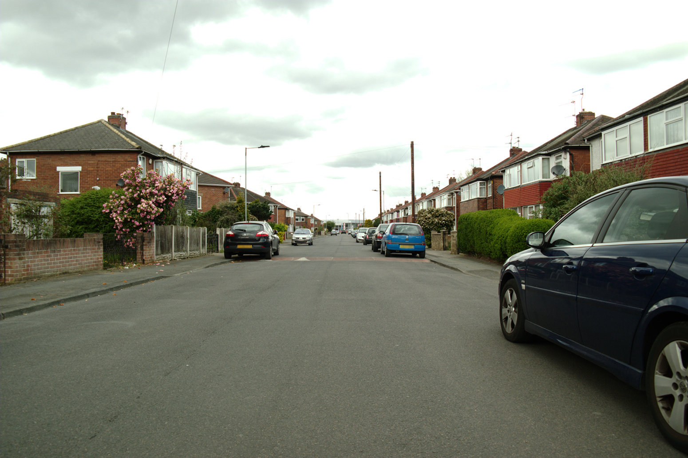
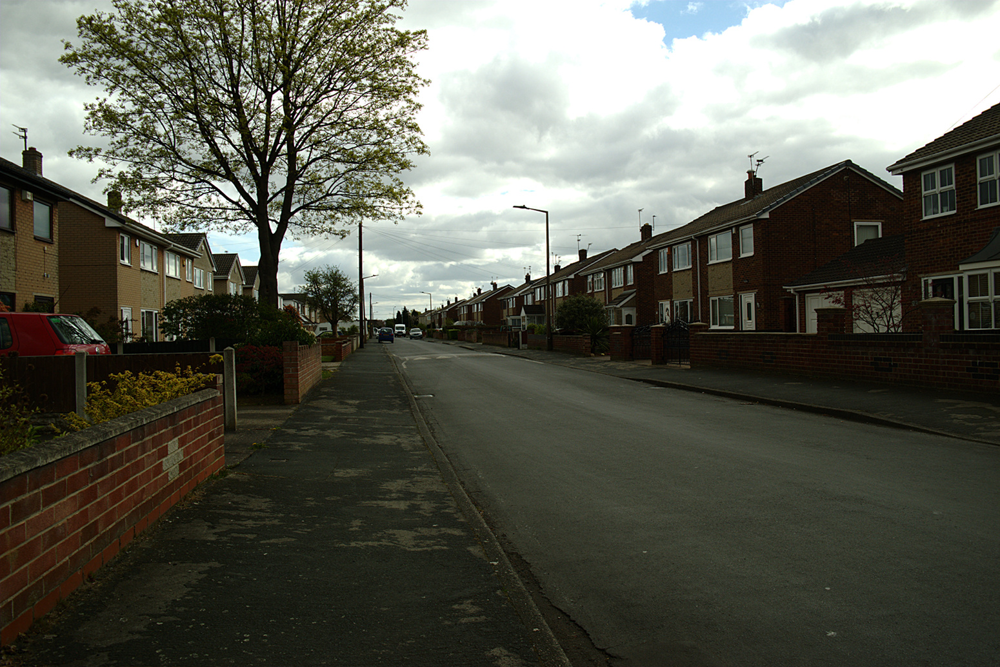
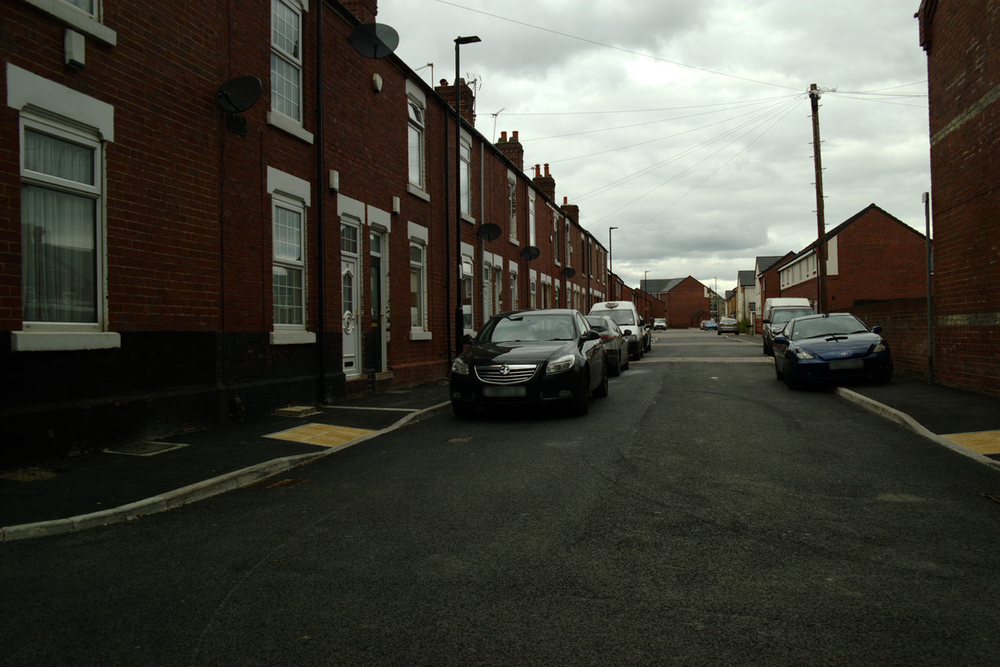
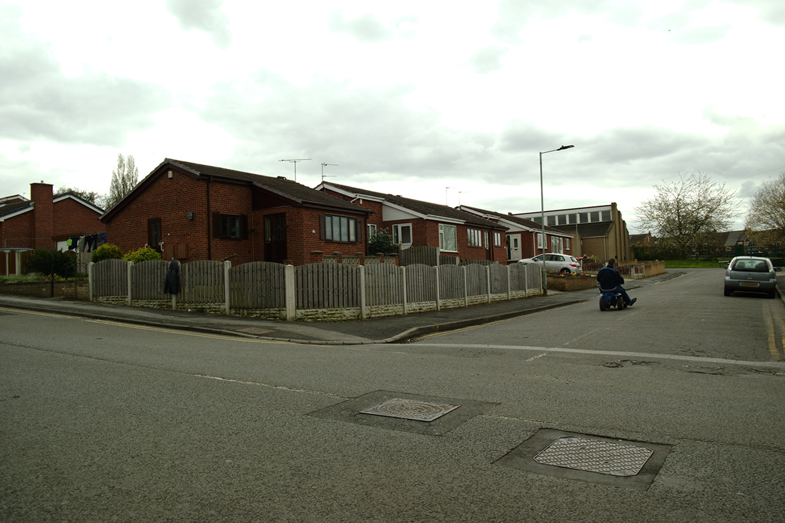

# Policy analysis {#policy}


## Introduction {#policy-introduction}

In the previous chapter I simulated and validated health resilience at the output area level in Doncaster.
The principal variables I used to articulate health outcomes and health resilience were clinical depression and measures of deprivation.
After simulating clinical depression at the individual level I was able to calculate the prevalence in each output area of Doncaster.
I then compared this with a number of area--based measures of deprivation such as the Index of Multiple Deprivation 2015 (IMD) and unemployment.

Alongside clinical depression I also simulated a number of variables that operationalised 'resilient' characteristics.
These characteristics were identified in the systematic literature review in Chapter \@ref(ressim) and were hypothesised as promoting health resilience and good health outcomes.
Using these two strategies I identified a number of output areas in Doncaster that could be considered resilient (Figure \@ref(fig:res-map)).

In this chapter I review the findings of these two strategies and compare them to other demographic, socio--economic, and area characteristics.
This allowed me to hypothesise which characteristics at the individual--level affect resilience at an area level.
I provide case studies of four areas in Doncaster that my simulation identified as resilient.
I also review a number of local and national policies that potentially have a differential effect due to differences in population or area characteristics to determine which individuals and areas might be affected by these changes.
These analyses were made possible by simulating a range of economic and social status variables alongside resilience which I described in Chapter \@ref(smslit).


## Local area {#policy-local-area}

<!--
- Consider proximity of amenities 
    + Moran's *I*
    + (scatter) plot distance from one area against gain (e.g. income gain in £ (x); distance from city centre in metres (y))
-->

```{r urban-rural-resilience-map, out.width="100%", fig.cap="Rural-urban classification of resilient areas", cache=TRUE}
tmap::tm_shape(don_oa) +
  tmap::tm_borders("dark grey") +
tmap::tm_shape(don_oa[is.na(don_oa@data$prison_pop) &
                             don_oa@data$res_total > 0, ]) +
  tmap::tm_fill("rural_urban",
                title = "Rural-urban classification of resilient OAs",
                palette = "Set2") +
tmap::tm_layout(frame = FALSE)
```

The majority of the resilient areas are high density urban areas that are part of the South Yorkshire minor conurbation.
A smaller number of output areas to the north east of the borough are urban, but not part of the South Yorkshire conurbation, so are not as densely populated.

A settlement is considered urban if it has a population of at least 10,000, 
and an output area is considered urban if "the majority of the population of a particular OA live in such a settlement..." [@bibby2013b, para 1.5].
Areas are further considered a conurbation if they have a high population density per hectare cell [@bibby2013a, para 4.11], so are the urban areas with the highest population densities.

As many of the resilient areas are in high density conurbations it may be that residents in more densely populated areas are more likely to be resilient.
If this is the case, this could be because of greater proximity to health--conducive amenities, for example a general practice, leisure facilities, or green space.

```{r doctors, out.width="100%", fig.cap="Doctors surgeries in Doncaster with resilient areas shaded", cache=TRUE}
tmap::tm_shape(don_oa) +
  tmap::tm_borders("dark grey") +
tmap::tm_shape(don_oa[don_oa@data$res_depr == TRUE, ]) +
  tmap::tm_fill("res_depr", legend.show = FALSE) +
tmap::tm_shape(doctors) +
  tmap::tm_bubbles(size = 0.2) +
  tmap::tm_layout(frame = FALSE)
```

I explored this by comparing the mean distance to a doctor's surgery, leisure centre, and green space from the resilient output areas against the mean distance from the non--resilient output areas.
These were post--hoc tests, so further analyses with new data or in other areas are necessary to make any conclusive statements.
A similar approach has been used by @campbell2013a to examine if distance affects a variable of interest [-@campbell2013a, p. 281--283].
I used the centroids of the output areas as the origin which provides an 'average' distance from the output area to the nearest amenity.
This approach does not take account of population density within the output area---as the majority of the population may not live near the centroid of the output area---or how the road or footpath network affects the journey.
Nevertheless, as output areas are small geographies this should not have affected the analysis significantly.
Doctor's surgeries and leisure centres were recorded as spatial points so the distances could be calculated directly.
Green spaces were recorded as polygons so I again used their centroids when calculating distances.

```{r doctor-distances}
dist_dr_res <- don_oa_cent@data %>% 
  filter(!is.na(res_total)) %>% 
  filter(res_total > 0) %>% 
  summarise(
    median = median(min_dist_doc),
    mean   = mean(min_dist_doc),
    sd     = sd(min_dist_doc))

dist_dr_nonres <- don_oa_cent@data %>% 
  filter(!is.na(res_total)) %>% 
  filter(res_total == 0) %>% 
  summarise(
    median = median(min_dist_doc),
    mean   = mean(min_dist_doc),
    sd     = sd(min_dist_doc))
```

I obtained the postcodes for all GP surgeries in Doncaster from the Care Quality Commission [@cqc2017a] and geocoded these into coordinates using the Google Maps Geocoding API [@google-geocode].
I obtained coordinates for leisure centres in Doncaster directly from the Google Maps Places API [@google-places].
Finally I obtained polygons for green spaces from the Ordnance Survey Open Greenspace data file [@os-greenspace] and obtained centroids from the polygon data.

```{r depression-diagnoses, eval=FALSE}
sim_depress_yes <- res_weights_int[res_weights_int$depress == "depress_yes", 
                                   grep("ghq_", colnames(res_weights_int))]

sim_depress_no  <- res_weights_int[res_weights_int$depress == "depress_no",
                                   grep("ghq_", colnames(res_weights_int))]

lapply(colnames(sim_depress_yes), function(x) {
  result_yes <- prop.table(table(sim_depress_yes[[x]]))
  result_no  <- prop.table(table(sim_depress_no[[x]]))
  
  stopifnot(
    all.equal(names(result_yes), names(result_no))
  )
  
  result <- as.table(do.call(rbind, list(result_yes, result_no)))
  
  result
})
```

Figure \@ref(fig:doctors) shows the location of doctor's surgeries in Doncaster with resilient output areas highlighted.
The mean distance to a doctor's surgery for resilient areas is `r format(dist_dr_res$mean, digits = 0, big.mark = ",")` metres (sd `r format(dist_dr_res$sd, digits = 0, big.mark = ",")`m), and for non--resilient areas is `r format(dist_dr_nonres$mean, big.mark = ",", digits = 0)` metres (sd `r format(dist_dr_nonres$sd, big.mark = ",", digits = 0)`m).
Ease of access to a doctor's surgery could therefore be an important protective factor for clinical depression, and additional practices, especially in areas outside the main urban centres, might be beneficial for resilience and clinical depression.

```{r leisure centre distances}
dist_lc_res <- don_oa_cent@data %>% 
  filter(!is.na(res_total)) %>% 
  filter(res_total > 0) %>% 
  summarise(
    median = median(min_dist_lc),
    mean   = mean(min_dist_lc),
    sd     = sd(min_dist_lc))

dist_lc_nonres <- don_oa_cent@data %>% 
  filter(!is.na(res_total)) %>% 
  filter(res_total == 0) %>% 
  summarise(
    median = median(min_dist_lc),
    mean   = mean(min_dist_lc),
    sd     = sd(min_dist_lc))
```

```{r plot-leisure-centres, out.width="100%", fig.cap="Location of leisure centres in Doncaster with resilient areas shaded", cache=TRUE}
tmap::tm_shape(don_oa) +
  tmap::tm_borders("dark grey") +
tmap::tm_shape(don_oa[don_oa@data$res_depr == TRUE, ]) +
  tmap::tm_fill("res_depr", legend.show = FALSE) +
tmap::tm_shape(leisure_centres) +
  tmap::tm_bubbles(size = 0.2) +
  tmap::tm_layout(frame = FALSE)
```

Figure \@ref(fig:plot-leisure-centres) shows the location of leisure centres in Doncaster, with resilient output areas highlighted.
The mean distance to a leisure centre for resilient areas is `r format(dist_lc_res$mean, digits = 0, big.mark = ",")` metres (sd `r format(dist_lc_res$sd, digits = 1, big.mark = ",")`m), while the mean distance for non--resilient areas is `r format(dist_lc_nonres$mean, digits = 0, big.mark = ",")` metres (sd `r format(dist_lc_nonres$sd, digits = 0, big.mark = ",")`m).
As with a GP surgery, the proximity of a leisure centre could confer some protective benefits to nearby residents and careful planning of future sites could be beneficial to currently under--served populations.

```{r plot-greenspace, out.width="100%", fig.cap="Doncaster green space", cache=TRUE}
tm_shape(don_outline) +
  tm_borders("dark grey") +
tm_shape(gs) +
  tm_polygons("#2ca25f") +
tm_layout(frame = FALSE)
```

```{r greenspace-distances}
dist_gs_res <- don_oa_cent@data %>% 
  filter(!is.na(res_total)) %>% 
  filter(res_total > 0) %>% 
  summarise(
    median = median(min_dist_gs),
    mean   = mean(min_dist_gs),
    sd     = sd(min_dist_gs))

dist_gs_nonres <- don_oa_cent@data %>% 
  filter(!is.na(res_total)) %>% 
  filter(res_total == 0) %>% 
  summarise(
    median = median(min_dist_gs),
    mean = mean(min_dist_gs),
    sd   = sd(min_dist_gs))
```

Figure \@ref(fig:plot-greenspace) shows the location of green spaces in Doncaster, taken from Ordnance Survey's newly--released Open Greenspace data set [@os-greenspace].
I created a matrix of distances between green spaces and output areas, using the centroids of each.
I then filtered these, leaving the minimum distance as an indication of the distance to the closest green space.
The mean distance to green space from a resilient output area is `r format(dist_gs_res$mean, digits = 1, big.mark = ",")` metres (sd `r format(dist_gs_res$sd, digits = 1, big.mark = ",")`m), while for non--resilient areas the mean distance is `r format(dist_gs_nonres$mean, digits = 1, big.mark = ",")` metres (sd `r format(dist_gs_nonres$sd, digits = 1, big.mark = ",")`m).

The spatial microsimulation model is not coded to be aware of, or constrain based on, the distance to a GP surgery, leisure centre, or green space.
Nevertheless the distance to these facilities for resilient areas is consistently shorter than for non--resilient areas based on clinical depression outcomes.
This supports the hypothesis that the local area has an important role to play in health and resilience, and that improving access to facilities could be an important step in maintaining and improving health.


## Case studies {#policy-case-studies}

As part of my research I visited four areas in Doncaster that were identified by the simulation as resilient for clinical depression.
Using the definition of low clinical depression I chose two areas that were resilient despite high unemployment, and two areas that were resilient despite high proportions of routine and manual (NS--SEC 7) employment.
I chose these criteria to represent those in poverty or living in a deprived area but who are relatively well--off in terms of outcomes for clinical depression.
Unemployment is associated with poor economic circumstances, but increasingly  families in employment are being affected [@mpse2016], so it was appropriate to include those in the lowest grades of employment who are most likely to be at risk of poverty.

I selected these areas to be as representative as possible of similar areas in Doncaster, although I do not claim they are representative in any statistical or formal sense.
Nevertheless they are illustrative of the broad range of communities in the Doncaster borough.
From these areas I sampled a small number of simulated individuals who represent the modal or most common characteristics of residents in these areas.
This is a technique that has successfully been used before with spatially microsimulated data [@campbell2013a, p. 283].

Two areas are in the main Doncaster town itself, a short distance from the town centre.
One area is a suburb to the north east of the town, in Armthorpe.
Finally, one area is in Denaby Main, one of the most deprived areas in the borough.

```{r case-study-areas, fig.width=7, fig.height=7, fig.cap="Case study areas. Motorways (blue), primary roads (green), and urban areas (light grey) are shown for context", cache=TRUE}
cs_areas <- 
  tm_shape(don_outline) +
    tm_borders("#bdbdbd") +      # grey
  tm_shape(don_context[[4]]) +   # urban areas
    tm_fill() +
  tm_shape(don_context[[2]]) +   # a roads
    tm_lines(col = "#2ca25f") +  # green
  tm_shape(don_context[[3]]) +   # primary roads
    tm_lines(col = "#2ca25f") +  # green
  tm_shape(don_context[[1]]) +   # motorways
    tm_lines(col = "#045a8d", legend.col.show = TRUE) +  # blue
  tm_shape(don_oa[is.na(don_oa@data$prison_pop) &
                    !is.na(don_oa@data$case_study), ]) +
    tm_polygons("case_study", palette = "Accent",
                title = "Case study area") +
  tm_layout(frame = FALSE)

cs_areas
```

### Wheatley

```{r case-study-1, fig.cap="Case study area 1: Wheatley"}

```

```{r wheatley-label}
wheatley <- don_oa@data$code[don_oa@data$case_study == "Wheatley" &
                               !is.na(don_oa@data$case_study)]
```

Wheatley is an area to the north of Doncaster town centre part of the South Yorkshire minor conurbation.
It is characterised as an 'urban professionals and families' area under the Output Area Classification system.
Accommodation is typically in the form of semi--detached housing (Figure \@ref(fig:case-study-1)).
The distance to a GP, leisure centre, and green space is 
`r don_oa_cent@data$min_dist_doc[don_oa_cent@data$code == wheatley]` metres, 
`r don_oa_cent@data$min_dist_lc[don_oa_cent@data$code == wheatley]` metres, and 
`r don_oa_cent@data$min_dist_gs[don_oa_cent@data$code == wheatley]` metres
respectively.

Based on the 2011 census the percentage of the over--16 population aged 65 and over is `r don_oa@data$pop_65_plus[don_oa@data$case_study == "Wheatley" & !is.na(don_oa@data$case_study)] / don_oa@data$pop_16_plus[don_oa@data$case_study == "Wheatley" & !is.na(don_oa@data$case_study)] * 100`%, compared to `r format(sum(don_oa@data$pop_65_plus) / sum(don_oa@data$pop_16_plus) * 100, digits = 1)`% for the borough overall.
Similarly the percentage of residents of Wheatley with a self--reported limiting long--term illness or disability is `r format(don_oa@data$cen_llid_yes_p[don_oa@data$case_study == "Wheatley" & !is.na(don_oa@data$case_study)] * 100, digits = 1)`%, compared to `r format(sum(don_oa@data$cen_llid_yes, na.rm = TRUE) / sum(don_oa@data$pop_16_plus, na.rm = TRUE) * 100, digits = 1)`% in Doncaster overall.
The percentage of the Wheatley population with clinical depression, based on the microsimulated data, is `r format(don_oa@data$depress_yes[don_oa@data$case_study == "Wheatley" & !is.na(don_oa@data$case_study)] / sum(don_oa@data$pop_16_plus[don_oa@data$case_study == "Wheatley" & !is.na(don_oa@data$case_study)], na.rm = TRUE) * 100, digits = 1)`%.

```{r wheatley-sample}
# The sample results are described but not plotted/tabled
# View the wheatley_sample object to see the sample results
wheatley_sample <- 
  res_weights_int %>%
  filter(zone == wheatley) %>% 
  filter(
    car  == "car_1",
    ten  == "ten_owned_mortgage_shared",
    qual == "qual_2",
    mar  == "mar_married" | mar == "mar_single",
    eca  == "eca_emp" | eca == "eca_retired",
    eth  == "eth_british")
```

Selecting individuals with the modal constraint characteristics left twelve simulated individuals.
Individuals were selected who owned one car, owned their home with a mortgage or with shared ownership, held level two qualifications, were either married or single, were either employed or retired, and were White British.
The selected individuals were aged 25--29, 30--44, or 45--59.

None of these twelve individuals reported having clinical depression, in keeping with the resilient nature of the individuals in the area.
Individual--level GHQ item responses were consistently in line with those expected of resilient characteristics.
Most respondents reported having good concentration, sleeping well, managing difficulties, managing or coping with strain.
All twelve respondents reported feeling useful, being able to make decisions, enjoying day--to--day activities, having confidence, being happy, and not being socially isolated.
These suggest many of the individual--level characteristics measured by the GHQ can contribute to resilience.
Responses to neighbourhood cohesion, neighbourhood trust, neigbourhood belonging, and subjective financial situation were more mixed, however.

Two--thirds of the individuals did not save any money, which may contribute to financial pressures later in life, which may in turn be linked to mental health problems.
Most consumed low levels of alcohol.
The median household income was `r median(wheatley_sample$hh_income)`, but inter--quartile range did range from £1,245 to £4,285 so a number of these households were below the poverty line yet still exhibited resilient characteristics.


### North Armthorpe

```{r north-armthorpe-photo, fig.cap="Case study area 2: North Armthorpe"}

```

```{r north-armthorpe-labels}
armthorpe <- 
  don_oa@data$code[don_oa@data$case_study == "North Armthorpe" &
                     !is.na(don_oa@data$case_study)]
```

North Armthorpe is an area on the northern edge of Armthorpe, itself to the north east of Doncaster town.
It is also part of the South Yorkshire minor conurbation.

It is characterised as 'semi--detached suburbia' under the Output Area Classification system.
As with Wheatley, accommodation is typically in the form of semi--detached housing (Figure \@ref(fig:north-armthorpe-photo)).
The distance to a GP, leisure centre, and green space is 
`r don_oa_cent@data$min_dist_doc[don_oa_cent@data$code == armthorpe]` metres, 
`r don_oa_cent@data$min_dist_lc[don_oa_cent@data$code == armthorpe]` metres, and 
`r don_oa_cent@data$min_dist_gs[don_oa_cent@data$code == armthorpe]` metres
respectively.
Unusually the distance to a GP is greater than to a leisure centre.

Based on the 2011 census the percentage of the over--16 population aged 65 and over is `r don_oa@data$pop_65_plus[don_oa@data$case_study == "North Armthorpe" & !is.na(don_oa@data$case_study)] / don_oa@data$pop_16_plus[don_oa@data$case_study == "North Armthorpe" & !is.na(don_oa@data$case_study)] * 100`%, compared to `r format(sum(don_oa@data$pop_65_plus) / sum(don_oa@data$pop_16_plus) * 100, digits = 1)`% for the borough overall.
Similarly the percentage of residents of North Armthorpe with a self--reported limiting long--term illness or disability is `r format(don_oa@data$cen_llid_yes_p[don_oa@data$case_study == "North Armthorpe" & !is.na(don_oa@data$case_study)] * 100, digits = 1)`%, compared to `r format(sum(don_oa@data$cen_llid_yes, na.rm = TRUE) / sum(don_oa@data$pop_16_plus, na.rm = TRUE) * 100, digits = 1)`% in Doncaster overall.
Based on the spatial microsimulated data, the percentage of the North Armthorpe population with clinical depression is also `r format(don_oa@data$depress_yes[don_oa@data$case_study == "North Armthorpe" & !is.na(don_oa@data$case_study)] / sum(don_oa@data$pop_16_plus[don_oa@data$case_study == "North Armthorpe" & !is.na(don_oa@data$case_study)], na.rm = TRUE) * 100, digits = 1)`%.

```{r north-armthorpe-sample, include=FALSE}
# The sample results are described but not plotted/tabled
# View the armthorpe_sample object to see the sample results
armthorpe_sample <- 
  res_weights_int %>% 
  filter(zone == armthorpe) %>% 
  filter(
    car  == "car_1" | car == "car_2_plus",
    ten  == "ten_owned_outright" | ten == "ten_owned_mortgage_shared",
    qual == "qual_2" | qual == "qual_0",
    mar  == "mar_married",
    eca  == "eca_emp" | eca == "eca_retired",
    eth  == "eth_british",
    age  == "age_30_44" | age == "age_45_59" | age == "age_65_74"
  )
```

I used the same procedure to select individuals with modal characteristics that I used for Wheatley.
This time I selected individuals who owned one or more cars, who owned their home outright or with a mortgage or shared ownership, who had no qualifications or up to level two qualifications only, were married, were employed or retired, were White British, and were aged either 30--44, 45--59, or 65--74.
This resulted in 40 individuals sharing these characteristics.

Of the 40, only two had clinical depression, again in keeping with the resilience of the area.
Approximately two--thirds reported having high neighbourhood cohesion, and a greater proportion again reported trust in the neighbourhood and a feeling of belonging to the neighbourhood.
Based on responses to the GHQ items most respondents reported being able to concentrate, did not have difficulty sleeping, felt useful, being able to make decisions, were confident, and felt happy.
Only one individual reported feeling socially isolated.

About half of the respondents did not save, and only a small proportion consumed high levels of alcohol.
The inter--quartile range of household incomes was £1,138 to £5,883 so again a number of households were in relative poverty but still exhibited resilient characteristics.
The range of incomes but relative consistency across resilient characteristics suggests there may be an area--level factor or factors that support individual--level resilience in North Armthorpe.


### Five Streets

```{r case-study-3, fig.width=7, fig.cap="Case study area 3: 'Five Streets'"}

```

```{r five-streets-labels}
five_streets <- don_oa@data$code[don_oa@data$case_study == "Five Streets" &
                                   !is.na(don_oa@data$case_study)]
```

Five Streets is located to the west of Doncaster town centre, near to the train station.
It is part of the South Yorkshire minor conurbation.

It is characterised as 'Challenged Asian Terraces' under the Output Area Classification system, reflecting the constrained circumstances residents of the area face.
Since the 2011 census many of the streets in the area have been redeveloped and rebuilt, although keeping the terraced nature of the original housing
 (Figure \@ref(fig:case-study-3)).
The distance to a GP, leisure centre, and green space is 
`r don_oa_cent@data$min_dist_doc[don_oa_cent@data$code == five_streets]` metres, 
`r don_oa_cent@data$min_dist_lc[don_oa_cent@data$code == five_streets]` metres, and 
`r don_oa_cent@data$min_dist_gs[don_oa_cent@data$code == five_streets]` metres
respectively.

Based on the 2011 census the percentage of the over--16 population aged 65 and over is `r don_oa@data$pop_65_plus[don_oa@data$case_study == "Five Streets" & !is.na(don_oa@data$case_study)] / don_oa@data$pop_16_plus[don_oa@data$case_study == "Five Streets" & !is.na(don_oa@data$case_study)] * 100`%, compared to `r format(sum(don_oa@data$pop_65_plus) / sum(don_oa@data$pop_16_plus) * 100, digits = 1)`% for the borough overall.
Similarly the percentage of residents of Five Streets with a self--reported limiting long--term illness or disability is `r format(don_oa@data$cen_llid_yes_p[don_oa@data$case_study == "Five Streets" & !is.na(don_oa@data$case_study)] * 100, digits = 1)`%, compared to `r format(sum(don_oa@data$cen_llid_yes, na.rm = TRUE) / sum(don_oa@data$pop_16_plus, na.rm = TRUE) * 100, digits = 1)`% in Doncaster overall.
Based on the spatial microsimulated data, the percentage of the Five Streets population with clinical depression is `r format(don_oa@data$depress_yes[don_oa@data$case_study == "Five Streets" & !is.na(don_oa@data$case_study)] / sum(don_oa@data$pop_16_plus[don_oa@data$case_study == "Five Streets" & !is.na(don_oa@data$case_study)], na.rm = TRUE) * 100, digits = 1)`%.

```{r five-streets-sample}
# The sample results are described but not plotted/tabled
# View the five_streets_sample object to see the sample results
five_streets_sample <-
  res_weights_int %>% 
  filter(zone == five_streets) %>% 
  filter(
    car  == "car_0" | car == "car_1",
    ten  == "ten_rented",
    qual == "qual_2" | qual == "qual_0" | qual == "qual_other",
    mar  == "mar_single",
    eca  == "eca_emp",
    eth  == "eth_british" | eth == "eth_asian_asian_british",
    age  == "age_30_44"
  )
```

Individuals with modal characteristics in Five Streets: owned either no cars or only one car; rented their home; had no qualifications, or up to level two qualifications; were single; were employed; were White British or Asian or Asian British; and were aged 30--44.
The population in Five Streets was therefore younger than the populations of Wheatley or North Armthorpe.

Four simulated individuals matched these criteria.
None had depression, again in line with the expected resilience of the area.
Neighbourhood cohesion, neighbourhood trust, and neighbourhood belonging were mixed or low in this area, especially compared to North Armthorpe.
Sample individuals had mixed financial situations, too.
However, the GHQ items still overall suggested the individuals in this area had resilient characteristics, such as concentration, good quality sleep, decision making, overcoming difficulties, confidence, and did not report social isolation.

None of the respondents drank high levels of alcohol, although most did not save money regularly.
Household income ranged from £1,103 to £2,733, so some households were in relative poverty but exhibited resilient characteristics.


### Denaby Main

```{r case-study-4, fig.cap="Case study area 4: Denaby Main"}

```

```{r denaby-main-labels}
denaby_main <- don_oa@data$code[don_oa@data$case_study == "Denaby Main" &
                                  !is.na(don_oa@data$case_study)]
```

Denaby Main is located to the west of Doncaster town centre at the edge of the district, near Conisborough and Mexbrough.
It is part of the South Yorkshire minor conurbation.

It is characterised as 'Industrious Communities' under the Output Area Classification system.
The resilient output area of Denaby Main features a community centre, a number of shops and a cafe, a number of sheltered accommodation buildings (Figure \@ref(fig:case-study-3)), and local green space.
These are reflected in the short distances to a GP, leisure centre, and green space.
These are 
`r don_oa_cent@data$min_dist_doc[don_oa_cent@data$code == denaby_main]` metres, 
`r don_oa_cent@data$min_dist_lc[don_oa_cent@data$code == denaby_main]` metres, and 
`r don_oa_cent@data$min_dist_gs[don_oa_cent@data$code == denaby_main]` metres
respectively.
These short distances could be helping to maintain and protect the health outcomes of the area, despite its deprivation.

Based on the 2011 census the percentage of the over--16 population aged 65 and over is `r don_oa@data$pop_65_plus[don_oa@data$case_study == "Denaby Main" & !is.na(don_oa@data$case_study)] / don_oa@data$pop_16_plus[don_oa@data$case_study == "Denaby Main" & !is.na(don_oa@data$case_study)] * 100`%, compared to `r format(sum(don_oa@data$pop_65_plus) / sum(don_oa@data$pop_16_plus) * 100, digits = 1)`% for the borough overall.
Similarly the percentage of residents of Denaby Main with a self--reported limiting long--term illness or disability is `r format(don_oa@data$cen_llid_yes_p[don_oa@data$case_study == "Denaby Main" & !is.na(don_oa@data$case_study)] * 100, digits = 1)`%, compared to `r format(sum(don_oa@data$cen_llid_yes, na.rm = TRUE) / sum(don_oa@data$pop_16_plus, na.rm = TRUE) * 100, digits = 1)`% in Doncaster overall.
Based on the spatial microsimulated data, the percentage of the Denaby Main population with clinical depression is `r format(don_oa@data$depress_yes[don_oa@data$case_study == "Denaby Main" & !is.na(don_oa@data$case_study)] / sum(don_oa@data$pop_16_plus[don_oa@data$case_study == "Denaby Main" & !is.na(don_oa@data$case_study)], na.rm = TRUE) * 100, digits = 1)`%.

```{r denaby-main-sample}
# The sample results are described but not plotted/tabled
# View the denaby_main_sample object to see the sample results
denaby_main_sample <- res_weights_int %>% 
  filter(zone == denaby_main) %>% 
  filter(
    car  == "car_1",
    ten  == "ten_owned_outright" | ten == "ten_owned_mortgage_shared",
    qual == "qual_0",
    mar  == "mar_married",
    eca  == "eca_emp",
    eth  == "eth_british",
    age  == "age_30_44" | age == "age_45_59"
  )
```

In Denaby Main the individuals with the modal characteristics: owned one car; owned their home outright or with a mortgage or shared ownership; had no qualifications; were married; were employed; were White British; and were aged 30--44 or 45--59.

Three simulated individuals matched these characteristics, and as with the other case study areas, none had clinical depression.
The respondents report that neighbourhood cohesion and trust are good in their area.
Their individual--level characteristics measured by the GHQ items are consistently good, including concentration, sleep quality, decision making, managing strain, overcoming difficulties, feeling useful, enjoying day--to--day activities, did not feel socially isolated, and consumed a low level of alcohol.

Across the four case study areas very few sample simulated individuals had clinical depression, which was expected given that these areas were identified as being resilient.
This was despite many of the households having a household income that would place them below the poverty line.

Individual--level characteristics, mainly measured by the GHQ items, were consistently good even among the individuals and households in poverty, suggesting these may provide protection against the effects of poor mental health and clinical depression.

Area--level characteristics were more mixed, but most simulated individuals in these areas still reported good neighbourhood cohesion, trust, and a sense of belonging, as well as access to facilities such as leisure centres, green space, and GP practices.
This suggests the nature of the local area and the facilites and amenities available to the residents is important.
The proximity and availability of amenities and facilities could be important to residents' health outcomes, and further research could test this hypothesis.

In the next sections I move on to review a number of local and national policies and their likely effect on the resources available to residents, and therefore their likely effect on their mental health outcomes and health resilience.


## Local and national policy effects {#policy-effects}

Spatially microsimulated datasets are powerful tools for identifying individuals, households, or areas who are likely to be affected by policy changes.
In cases where no appropriate data exists for examining these changes, simulated data makes it possible to at least examine *likely* changes.
Spatial microsimulated data has been used in this way in numerous cases, as outlined in Chapter \@ref(smslit).

After creating a spatially microsimulated dataset, this data can be filtered to identify observations that meet certain criteria.
For example, @campbell2013a were interested in several proposed policy changes including the suggestion of raising the bottom income tax threshold from £7,475 to £10,000.
Using their simulated data they were able to identify 'low earners' and map the proportion of these individuals in each small area [-@campbell2013a, p. 269--272].
A number of other spatial microsimulation used in the health domain are outlined in Chapter \@ref(smslit).

I use a similar technique in this section to assess the effects of local and national policy on Doncaster residents, for better or for worse.
In each case I outline the policy, identify what group or groups of individuals are most likely to be affected, and what these effects are likely to be.
Using these criteria I highlight the number of people in each output area in Doncaster who are likely to be affected by the policy, based on the additional economic and social variables simulated in Chapter \@ref(ressim).
This provides valuable small--area level evidence that could be used to address health inequality and improve quality of life for residents of Doncaster by ensuring that the implementation of local policy is used to mitigate or reduce the effects of these inequalities.

Doncaster Metropolitan Borough Council (DMBC) is currently prioritising four key policy areas: "Doncaster Learning"; "Doncaster Working"; "Doncaster Caring"; and "Doncaster Living" [@tillman2017a].
These will be the policy focus of DMBC to 2021.

### Doncaster Learning

The Doncaster Learning policy is designed to offer development and learning for all ages, but will start with early years.
People of all ages could therefore benefit, but it will be young people in compulsory education who will be most exposed to this policy and benefit most from it, if it is successful.

The policy should benefit all people in Doncaster who want to learn, and especially young people in compulsory education.
To ensure the Doncaster Learning policy benefits all young people equitably, it may be useful to understand the financial resources available to the families of young people, especially those with reduced circumstances.

```{r fin-sit-kids, out.width="100%", fig.cap="Number of children living in households in 'bad' financial situation", cache=TRUE}
fin_bad_kids <- tm_shape(don_oa[is.na(don_oa@data$prison_pop), ]) +
  tm_polygons(col = "fin_bad",
              title = "Children in households in 'bad' financial situation") +
  tm_layout(frame = FALSE)
fin_bad_kids

tmap::save_tmap(fin_bad_kids, "figures/cache/fin_bad_kids.png", dpi = 96, 
                width = 1080, units = "px")
```

Figure \@ref(fig:fin-sit-kids) illustrates the number of children in households in a poor subjective financial situation.
These are households that report they are "finding it quite difficult" or "finding it very difficult" to manage financially, a characteristic that has been suggested to be important to resilience (see Chapter \@ref(sysrev)).

Areas in Conisborough and Mexbrough, Carcroft and Bentley, New Rossington, Doncaster town itself, and also Thorne, have relatively high numbers of children living in families that are finding it quite difficult or very difficult to manage financially.
It is therefore these areas that any goals should be mindful of when planning Doncaster Learning services.
For example, with the possible exception of those living in Doncaster town itself, free or low--cost, frequent, and reliable public transport should be available to those areas with high numbers of children and young people in poverty.
This would allow them to access education, particularly if they do not live in a family with access to a car.

Provision for free school meals are likely to be higher in primary and secondary schools in these areas.
Community centres, youth groups, and after--school clubs could be supported in these areas to encourage children and young people to make the most of their education and to provide educational activities to support their studies.
It may also be necessary to ensure health provision for children and young people in these areas---including mental health and sexual health services---is sufficient to meet demand, which is likely to be higher in these areas.
Planning and provision of supplementary services that enable these children and young people to get the most out of the education are vital to ensure they flourish and are able to "pursue fulfilling jobs, careers and lives" [@tillman2017a].

Figure \@ref(fig:map-no-savings) shows the number of people in each output area who do not save money, again illustrating the nature of material deprivation in Doncaster.
While it is more common for people not to save, even in relatively economically wealthy areas, there is still a pattern of low savings in the areas already identified lending further weight to the need for transport, health, and educational support services to help young people from these areas access education.

```{r map-no-savings, fig.cap="Number of individuals who do not regularly save", cache=TRUE}
tm_shape(don_oa[is.na(don_oa@data$prison_pop), ]) +
  tm_fill(col = "save_no", title = "No savings") +
  tm_shape(don_oa) +
  tm_borders("dark grey") +
  tm_layout(frame = FALSE)
```


### Doncaster Working

The purpose of the 'Doncaster Working' policy is to encourage and create high--quality jobs for local people, to improve their quality of life.
Improving conditions of lower grade and lower quality employment, often typified by routine and manual employment, is most likely to improve feelings of fulfilment and job opportunity.

```{r map-work-age-poverty, out.width="100%", fig.cap="Number of individuals of working age (16-65) in employment but living in poverty", cache=TRUE}
work_age_poverty <- tm_shape(don_outline) +
  tm_borders("dark grey") +
tm_shape(don_oa[is.na(don_oa@data$prison_pop), ]) +
  tm_polygons(col = "work_age_pov",
              title = "Working age population in poverty") +
tm_layout(frame = FALSE, legend.position = c("left", "top"))
work_age_poverty

tmap::save_tmap(work_age_poverty, "figures/cache/work_age_poverty.png",
                dpi = 96, width = 1080, units = "px")
```

Figure \@ref(fig:map-work-age-poverty) shows the number of people in each Doncaster output area who are of working age (16--65) and in employment, but who live in poverty.
Areas with higher numbers of people in working poverty include: Doncaster town itself; Conisborough and Mexborough to the west; Carcroft and Bentley to the north; and Stainforth and Thorne to the north east.

This gives an indication of the number of the number of individuals working in low quality employment, for example in routine and manual occupations.
They suggest people are working, but that the amount they are paid does not allow them to make ends meet.
This could be for a variety of reasons, including: employment in casual labour ('zero--hour') contracts that do not guarantee enough income when averaged over a week or month; having to take part--time work that does not pay sufficiently; or simply a low--paying job, for example because it is unskilled.

These areas should receive focus from the Doncaster Working policy.
Policies implemented as part of this programme should aim to mitigate the effects of poverty and deprivation for these individuals in these areas.
Taking the examples above, this could be by: reducing or legislating against 'zero--hour' contracts; helping those in part--time work, for example by assisting with caring responsibilities or 'topping up' incomes of part--time workers; or improving the job base in Doncaster and moving towards a higher--skilled labour force. 

### Doncaster Caring

```{r map-sol-isol, out.width="100%", fig.cap="Number of people in social isolation", cache=TRUE}
soc_isol <- tm_shape(don_outline) +
  tm_borders("dark grey") +
tm_shape(don_oa[is.na(don_oa@data$prison_pop), ]) +
  tm_polygons(col    = "soc_isol",
              title  = "Number in social isolation",
              textNA = "Prison OA") +
tm_layout(frame = FALSE, legend.position = c("left", "top"))
soc_isol

tmap::save_tmap(soc_isol, "figures/cache/soc_isol.png", dpi = 96,
                width = 1080, units = "px")
```

Figure \@ref(fig:map-sol-isol) shows the number of people in each output area who report experiencing or feeling socially isolated.
Social isolation and loneliness are demonstrably associated with poorer physical and mental health (see section \@ref(reslit-soc-isol)) so should be addressed by the Doncaster Caring policy.

The spatial distribution of people in social isolation differs somewhat from the pattern of poverty or deprivation.
For example, as well as the higher numbers that are typically seen in Conisborough, Mexborough, Doncaster, Bentley, Sprotborough, and Thorne for measures of deprivation, there are also areas of Sykehouse to the north (west of Thorne) and Bawtry to the south that have a relatively high number of people experiencing social isolation.

As part of the Doncaster Caring policy it should be determined what demographic factors, or combination of factors, are associated with social isolation and loneliness and attempt to tackle this.
For example, it may be that older people or certain ethnic groups---or a combination of the two---are more likely to experience social isolation despite the relatively low deprivation experienced by these areas.

The proportion of the population aged 65 and over in the output area near Bawtry to the south of the borough ('E00038534') is `r don_oa@data$pop_65_plus[don_oa@data$code == "E00038534"] / don_oa@data$pop_16_plus[don_oa@data$code == "E00038534"]`, compared to just `r sum(don_oa@data$pop_65_plus) / sum(don_oa@data$pop_16_plus)` for the borough overall.
The proportion of people aged 65 and over is closer to this figure for the other two output areas.
Despite this the *number* of older people aged 65 and over is higher in each of these output areas (`r don_oa@data$pop_65_plus[don_oa@data$code == "E00038661"]`, 
`r don_oa@data$pop_65_plus[don_oa@data$code == "E00038528"]`, and 
`r don_oa@data$pop_65_plus[don_oa@data$code == "E00038534"]`, compared to a median of `r median(don_oa@data$pop_65_plus)` per output area for the borough overall), and in two of the three the number is nearly double.

The number of individuals in these three output areas who are White British is higher than the median number per output area for the borough overall (`r don_oa@data$eth_british[don_oa@data$code == "E00038661"]`, `r don_oa@data$eth_british[don_oa@data$code == "E00038528"]`, and `r  don_oa@data$eth_british[don_oa@data$code == "E00038534"]`, compared to the median of `r median(don_oa@data$eth_british)` overall).
Further exploration of the factors that affect social isolation in these areas should be undertaken, but these initial descriptions suggest that age, ethnicity, or an interaction of the two, could affect social isolation in Doncaster.

As a majority urban area, Doncaster residents are at greater risk of the effects of air pollution compared to individuals living in less urban areas [@pascal2013a].
Air pollution---especially particulate matter---affects the respiratory and cardiovascular health of individuals, and recent evidence from a study in the United States suggests there may be an association between air pollution and anti--depressant use in women [@kioumourtzoglou2017a].
In Europe the greatest number of deaths attributable to air pollution are caused by coronary heart disease (CHD), including angina, heart attack or myocardial infarction, and stroke [@who2016a, p. 41, Figure 14].

```{r plot-chd, out.width="100%", fig.cap="Number of residents with CHD or stroke", cache=TRUE}
tm_shape(don_oa) +
  tm_borders() +
tm_shape(don_oa[is.na(don_oa@data$prison_pop), ]) +
  tm_polygons(col = "ihd", title = "CHD or stroke") +
tm_layout(frame = FALSE)
```

Figure \@ref(fig:plot-chd) shows the number of residents with a diagnosis of CHD or stroke in each output area.
The area of Sykehouse again features prominently on this map, although this may be because of the age of residents in this output area.
The risk of developing CHD increases with age and is most common in the over--50 age group [@nhs-chd].

```{r plot-chd-rate, out.width="100%", fig.cap="Proportion of over-45 population with a diagnosis of coronary heart disease (CHD)", cache=TRUE}
tm_shape(don_oa) +
  tm_borders("dark grey") +
tm_shape(don_oa[is.na(don_oa@data$prison_pop), ]) +
  tm_polygons("p_ihd",
          title = "Proportion of at-risk
population with
CHD diagnosis") +
tm_layout(frame = FALSE)
```

Figure \@ref(fig:plot-chd-rate) shows the proportion of the population aged 45 and over with a diagnosis of CHD.
I have had to include those aged 45--50 because of how the data is constructed to match the census tables, but should still represent the 'at--risk' population for CHD.

With this figure it is easier to see how the proportion of the at--risk population with CHD is associated with the proximity to an urban area, with greater prevalence near town centres.
Doncaster Caring could examine the level of air pollution in these areas---or traffic density as a proxy---and identify areas where individuals are at increased risk of mortality as a result of poor air quality.

### Doncaster Living

Doncaster Living aims to improve the living environment for Doncaster residents:

> [Doncaster Living will provide...] access to a full range of housing options, offering homes for life, a top class culture and leisure offer; quality, thriving town centres; an increasingly safe and secure setting. [@tillman2017a]

```{r prop-income-rent, fig.cap="Median proportion of household income spend on rent or mortgage, £", out.width="100%", cache=TRUE}
tm_shape(don_oa) +
  tm_polygons(col = "hh_prop", title = "Proportion income spend on rent") +
  tm_layout(frame = FALSE)
```

Examining housing options first, Figure \@ref(fig:prop-income-rent) shows the median proportion of household income spend on housing costs (rent or mortgage) for each output area.
This shows the areas where residents are spending a higher proportion of their household income on housing costs, leaving them less money for other necessities and limiting their disposable income.
These are the areas that could most benefit from increased affordable housing, or support with housing costs for residents in these areas, or support with finding better quality employment.

```{r plot-safe-alone, out.width="100%", fig.cap="Number of people who do not feel safe alone after dark in their area", cache=TRUE}
tm_shape(don_oa) +
  tm_borders("dark grey") +
tm_shape(don_oa[is.na(don_oa@data$prison_pop), ]) +
  tm_polygons(col = "safe_alone", title = "Not safe after dark") +
  tm_layout(frame = FALSE)
```

Figure \@ref(fig:plot-leisure-centres) shows the location of leisure centres in Doncaster.
Other maps of leisure amenities could be produced using geocoded data, and goals for Doncaster Living may wish to take these in to account in devising policy goals to maximise the leisure facilities on offer in Doncaster.

Figure \@ref(fig:plot-safe-alone) shows the number of people in each area who state they do not feel safe out alone after dark in their area ('a bit unsafe', 'very unsafe', and 'do not go out alone after dark').
While this could include some individuals who do not go out after dark for other reasons, this overall captures the areas of low subjective community safety.
The subjective feeling might be as important, or more important, than objective levels of crime or anti--social behaviour, so should be considered as part of the Doncaster Caring alongside any counts of crimes.

### Universal credit

As well as local policy initiatives discussed above, there are a number of national policy initiatives implemented by central government that will affect the residents of Doncaster.
For example Universal Credit is set to replace a number of existing benefits, including: income--based jobseeker’s allowance (JSA); housing benefit; working tax credit; child tax credit; income--related employment and support allowance (ESA); and income support [@uc-replace].
The transition to Universal Credit in its current form has been heavily criticised, as it is driving some people into debt and poverty [@mason2017a; @butler2017a].

Those who are on a low income or out of work are eligible for Universal Credit [@uc-eligibility].
Table \@ref(tab:uc-eligibility) illustrates the circumstances under which individuals and couples can claim Universal Credit.

```{r uc-eligibility-setup}
uc_eligibility <- data.frame(
  c("Circumstances",          "Monthly standard allowance"),
  c("Single and under 25",                       "£251.77"),
  c("Single and 25 or over",                     "£317.82"),
  c("In a couple and both under 25",             "£395.20"),
  c("In a couple and either partner 25 or over", "£498.89"),
  stringsAsFactors = FALSE
) %>% 
  t(.)
```

```{r uc-eligibility}
knitr::kable(uc_eligibility, 
             caption = "Standard allowance amounts for Universal Credit claimants. Source: Gov.uk",
             row.names = FALSE)
```

There are three issues that are likely to require policy intervention from DMBC and other service providers in relation to Universal Credit.
One is that some people may be affected by a short period when their existing benefits stop and before they receive payment of Universal Credit [@uc-replace].
Such a period for someone near the poverty line may temporarily cause them to 'dip' into poverty, and they are likely to need additional support during this transition.

Two, the number of people eligible for at least some portion of Universal Credit is difficult to calculate because the eligibility rules are broad, merely specifying 'low income' or 'out of work' [@uc-eligibility].
Using data on household income, benefits, and cohabiting status in *Understanding Society*, I have been able to estimate the number of individuals in each area of Doncaster eligible for at least some Universal Credit.

Three, even those individuals who earn more than the work allowance amounts are not necessarily earning a sufficient income to keep them out of relative poverty.
Other approaches should be considered to help these people out of poverty in the absence of state benefits.

For each of these three cases I highlight the areas where individuals are most likely to be affected and discuss effects and possible mitigation below.

### Transition to Universal Credit

*Understanding Society* contains rich information about benefits received by respondents, including the benefits Universal Credit is replacing (see section \@ref(universal-credit)).
Of the benefits that are being replaced with Universal Credit, only income--related employment and support allowance (ESA) does not have complete details.
Claimaints can apply for contribution--based ESA, which is paid if their national insurance contributions are sufficient, or a means--tested income--based payment.
Current government literature states only the income--based ESA is being replaced with Universal Credit, but it is not possible to separate contribution--based claimants from income--based claimants of ESA in *Understanding Society*.
Therefore the following estimates are likely to be slightly higher as I cannot remove contribution--based ESA claimaints from my model.
Nevertheless, the model contains information on income support, job seeker's allowance, working and child tax credit, and housing benefit, so provides useful evidence about the number of people in each area who are likely to be affected by the transition to Universal Credit.
The transition can take several weeks which, although short--term, can cause long--term issues as claimants try to recover from poverty [@presser2016a].

Figure \@ref(fig:plot-uc-replace) shows the number of claimants in each area receiving a state benefit that is to be replaced by Universal Credit, so are likely to have a transition period where they may experience additional financial strain and may 'dip' into temporary poverty.

```{r plot-uc-replace, out.width="100%", fig.cap="Number of individuals receiving benefits that are to be replaced by Universal Credit", cache=TRUE}
uc_replace <- tm_shape(don_oa[is.na(don_oa@data$prison_pop), ]) +
  tm_fill("uc_replace", title = "Recipients of benefits being
replaced with Universal Credit") +
tm_shape(don_oa) +
  tm_borders("dark grey") +
tm_layout(frame = FALSE)
uc_replace

tmap::save_tmap(uc_replace, "figures/cache/uc_replace.png", dpi = 96,
                width = 1080, units = "px")
```

DMBC should use this information to plan ways to mitigate any harm caused by this transition and support claimants during this time.
For example, claims for discretionary housing payments [@dhp-shelter; @dhp-gov] could help to cover housing costs for claimants during this time.

### Universal Credit eligibility

Calculating a precise number of people who are eligible for Universal Credit is challenging because the criteria are broad without much specificity [@uc-eligibility].
I have estimated the number of people eligible for Universal Credit in each area of Doncaster using information in Understanding Society on benefits, household income, and cohabiting status.

Individuals and couples claiming Universal Credits have a 'work allowance' up to which they can still receive their full Universal Credit payment.
For every £1 earned above this work allowance threshold, the payment of Universal Credit is reduced by 63 pence, often referred to as the 'taper rate'.
The work allowance is £192 per month for those who get help with housing costs, and £397 per month for those who do not get help with housing costs [@uc-eligibility].

Taking the greater figure I have calculated the amounts each individual can earn before losing all Universal Credit, based on their circumstances.
This has the effect of implicitly assuming that Universal Credit covers the claimant's housing costs which will not necessarily always be the case, especially when claimants lose some of their housing support because of under--occupancy, sometimes referred to as the 'bedroom tax'.
These amounts are presented in Table \@ref(tab:maximum-earnings-uc).

```{r maximum-earnings-uc}
data.frame(
  c("Circumstances",                     "Maximum earnings"),
  c("Single under 25",                   "£796.63"),
  c("Single 25 or over",                 "£901.48"),
  c("Couple (both under 25)",            "£1024.30"),
  c("Couple (either partner over 25)",   "£1188.88"),
  stringsAsFactors = FALSE
) %>% 
  t(.) %>% 
  knitr::kable(., caption = "Maximum monthly earnings before being ineligible for Universal Credit. Source: gov.uk; own calculation",
               row.names = FALSE)
```


```{r plot-uc, out.width="100%", fig.cap="Number of residents who are eligible for Universal Credit", cache=TRUE}
tm_shape(don_oa[is.na(don_oa@data$prison_pop), ]) +
  tm_fill("uc", title = "Number can claim
Universal Credit") +
tm_shape(don_oa) +
  tm_borders("dark grey") +
tm_layout(frame = FALSE)
```

Figure \@ref(fig:plot-uc) shows the number of people in each area who are eligible to claim Universal Credit using these criteria and assumptions.
Areas in Doncaster town centre, Conisborough, Mexborough, Bentley, Carcroft, Stainforth, Thorne, Rossington, and Bawtry have relatively high numbers of individuals who are eligible to claim Universal Credit.
Doncaster should support these individuals who are on the lowest incomes and most vulnerable to poverty.

One such approach could be to help them maximise their incomes.
Some people eligible for Universal Credit are also able to claim extra payments on top of their standard allowance [@uc-eligibility]. Table \@ref(tab:uc-extra-payment) summarises these additional payments and their eligibility requirements:

```{r uc-extra-payment}
data.frame(
  c("Circumstances",                          "Extra monthly amount"),
  c("For first child*",                       "£277.08"),
  c("For second child",                       "£231.67"),
  c("Help with childcare costs",              "85% of costs"),
  c("Disability, or severely disabled child", "£649.38 (maximum)"),
  c("Health condition prevents working",      "£318.76"),
  c("Care for a disabled person",             "£151.89"),
  stringsAsFactors = FALSE
) %>%
  t(.) %>% 
  knitr::kable(., caption = "Extra payment amount eligibility for Universal Credit claimaints. Source: Gov.uk. Notes: *based on child born after 6 April 2017", 
               row.names = FALSE)
```

Support from DMBC and other public agencies, as well as voluntary and third sector support services, could help these individuals to claim any extra entitlement.
It should be noted that social welfare payments are capped (the 'benefits cap') at the following amounts for those aged 16--64 living outside the Greater London area [@benefit-cap].
Therefore Universal Credit, including any extra payments, might not offer a complete solution to move people out of poverty.
Table \@ref(tab:benefit-cap) shows the cap amounts.

```{r benefit-cap}
data.frame(
  c("Circumstances",                     "Limit per week"),
  c("Couple (with or without children)", "£384.62"),
  c("Single person with children",       "£384.62"),
  c("Single person without children",    "£257.69"),
  stringsAsFactors = FALSE
) %>% 
  t(.) %>% 
  knitr::kable(., caption = "Benefit cap amounts for claimants living outside Greater London aged 16--64. Source: gov.uk",
               row.names = FALSE)
```

This cap might have detrimental effects on claimants if their needs are complex, for example if they are a carer or single parent, and the benefits cap prevents them from obtaining enough financial support to cover their living costs.

### Moving out of poverty

Some individuals who are earning more than the work allowance, and therefore are not eligible for Universal Credit, are not necessarily earning a sufficient income to keep them out of relative poverty.
Figure \@ref(fig:plot-poverty-not-eligible-uc) shows the number of individuals in each area in Doncaster who are in relative poverty---that is they earn less than 60% of median income---but who earn more than their relevant work allowance.

```{r plot-poverty-not-eligible-uc, out.width="100%", fig.cap="Number of individuals in relative poverty but not eligible for Universal Credit", cache=TRUE}
pov_ineligible_uc <- tm_shape(don_oa[is.na(don_oa@data$prison_pop), ]) +
  tm_fill("pov_not_uc", title = "Number in poverty but
not eligible for
Universal Credit") +
tm_shape(don_oa) +
  tm_borders("dark grey") +
tm_layout(frame = FALSE)
pov_ineligible_uc

tmap::save_tmap(pov_ineligible_uc, "figures/cache/pov_ineligible_uc.png",
                dpi = 96, width = 1080, units = "px")
```

For these people Universal Credit, and benefits, are not able to help them move out of poverty and thus need to be supported in other ways, such as by helping them to transition to more stable or higher--skilled employment.
Ideally the Universal Credit thresholds would be raised to help people like this move out of relative poverty, but in the absence of such an initiative from central government other approaches should be considered.
Not all individuals are able to work, and therefore move into more stable or higher--skilled employment, and any policy implemented should consider this to help all individuals out of poverty.


## Conclusion {#policy-analysis-conclusion}

In this chapter I have used spatial microsimulation outputs to illustrate some of the issues facing residents of Doncaster.
These have included a geographical analysis of the provision of health amenities and facilities, case studies of four resilient areas, and policy analysis of local and national policies aimed at supporting those on low incomes or in deprivation.

The geographical analysis highlighted that resilient areas, whether urban or not, tended to have better access to health amenities and facilities, such as a GP practice, leisure centre, or green space.
DMBC and other agencies should consider the location and proximity of any future facilities at the planning stage to maximise the benefits to health and resilience for as many individuals as possible.
Doncaster could also use this information to review and rationalise their current provision.

The case studies illustrated the characteristics and nature of four resilient areas, and the people who live in them.
Despite many of the individuals facing poverty and deprivation, none of the sampled individuals reported having clinical depression, in keeping with the resilient nature of the area.
Many of the individuals reported good mental health characteristics, reported through the use of the General Health Questionnaire instrument, so there is evidence that good mental health could confer resilience or protective benefits.

In two of the areas sampled residents were also highly diverse in their backgrounds and demographics, which may suggest the diversity of the area's population may confer additional protective or resilient benefits for residents.
This is at odds with the other two areas, where a sense of shared identity may be considered positive.
Further research might explore why some areas benefit from diversity, while others benefit from homogeneity.

Local policy---Doncaster Learning, Doncaster Working, Doncaster Caring, and Doncaster Living---are designed to help people obtain the best education they can, move into better quality work, and access high quality housing and leisure opportunities.
Doncaster Learning should prioritise children in poverty or who do not live near good quality public transport links to ensure they are able to access educational sites.
Other issues of access to education are important, such as the quality of education provision, but without addressing children in poverty they are likely to get left behind in terms of achievement and ultimately employment.

This is linked with Doncaster Working which aims to move residents out of low quality, low pay employment into better quality jobs.
With the spatially microsimulated data I have highlighted the areas where people are in work but in relative poverty, indicating where such policies should be targeted and which would not be possible without the spatial microsimulation.
Moving these individuals out of low quality work may also help improve their mental health, and therefore resilience, independent of any financial improvement in their circumstances.

Doncaster Caring seeks to maximise the provision of care and health care to those most in need.
Physical health is clearly important, but interventions and funding should seek to improve mental health, and therefore resilient, too.
Social isolation, for example, has been associated with detrimental physical and mental health, so with the spatial microsimulation I have been able to highlight areas with the greatest numbers experiencing social isolation.
There are clearly other concerns and criteria, but this should illustrate some of the areas that require support and funding under Doncaster Caring.

Doncaster Living aims to improve housing quality and community safety, as well as leisure provision.
Having already demonstrated the proximity of leisure centres and green space is associated with resilience, I also considered housing affordability and *perceived* community safety.
First, I was able to highlight where individuals spend the greatest proportion of their household incomes on housing.
This suggests people in these areas have low incomes and may need support or better opportunities to move to better quality housing.
For example, discretionary housing payments could be used to support these individuals with the financial cost of moving to a new, better quality, home.
It may also be necessary to see where these individuals overlap with those in low quality employment---Doncaster Working---to support them into higher quality jobs with higher incomes.
I was also able to highlight where individuals perceive their area as unsafe after dark.
In this case perception may be as important as any 'objective' measure of community safety when considering the quality of life of residents.
Improving housing quality and community safety are laudible goals, but it is important to not miss the areas most in need, such as those identified here.

National welfare policy is to move claimants to Universal Credit.
I cannot link the move to Universal Credit directly to health resilience empirically, but there are two key effects of Universal Credit that are likely to affect claimant's mental health.
The first is when transitioning to Universal Credit, claimants stop receiving their current benefit and then begin receiving their new benefit.
This can take several weeks, and can drive some people into poverty which becomes a long--term issue as they try to recover from it [@presser2016a].
Whether short-- or long--term, periods spent in poverty are detrimental to mental health which, as demonstrated above, is likely to have tangible effects on people's resilience and health.

The second issue with Universal Credit is that even those who earn more than the work allowance do not necessarily have an income that is sufficient.
Without being able to claim social welfare support, these individuals are then stuck in relative poverty, with the detrimental effect on health and resilience that this is associated with.
As they cannot claim social welfare benefits to help them out of poverty, other approaches should be considered by Doncaster.
Policies such as Doncaster Working---moving individuals to higher--skilled and better paying positions---should help many move into better quality and more stable employment.
Not everyone is able to work, however, for example because of caring responsibilities or disabilities, so any policy implemented should not just assume that better quality work can move everyone out of poverty.

These case studies, figures, and geographical analyses demonstrate the power of the spatial microsimulation technique and this model.
Identifying the people and areas most affected by poor health and resilience, low incomes, and deprivation would not be possible with only data available from the census or *Understanding Society* when analysed separately and without spatial microsimulation modelling.
With the spatial microsimulation it has been possible to identify specific individuals and areas that are most at risk of the effects of social welfare policies and health inequalities, which could allow the targeted intervention of local policy to mitigate or reduce the detrimental effects of these experienced by Doncaster residents.
